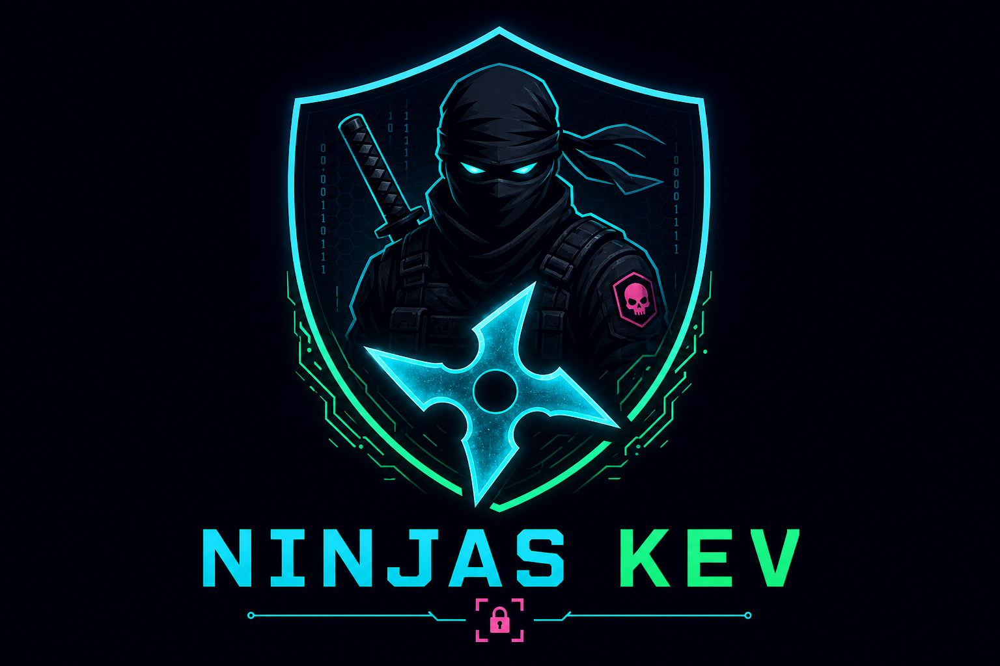
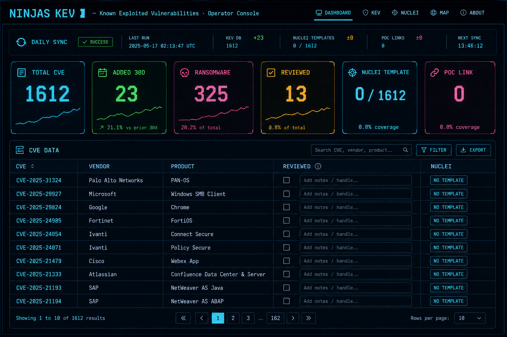

<p align="center">
  
</p>

<h1 align="center">Ninjas KEV</h1>

<p align="center">
  <strong>Known Exploited Vulnerabilities · Operator Console</strong>
</p>

<p align="center">
  CISA KEV ingestion · Nuclei coverage mapping · analyst review tracking — for red team, purple team, and SOC operators.
</p>

<p align="center">
  
  
  
  
  
  
</p>

<p align="center">
  
</p>

---

## Overview

**Ninjas KEV** is an internal operator console built on [CISA's Known Exploited Vulnerabilities (KEV)](https://www.cisa.gov/known-exploited-vulnerabilities-catalog) catalog — a curated list of CVEs with **confirmed active exploitation** in real-world attacks.

The official feed is distributed as JSON. At scale it is difficult to triage, correlate with detection assets, and track analyst coverage. Ninjas KEV ingests that feed and exposes it through a **web-based SOC dashboard** backed by a Python HTTP server, scheduled sync jobs, and a local **CVE↔Nuclei mapping pipeline**.

This repository is the **Git operator bundle** (`ui_variant: git`) — login-protected, deployed via **GitHub clone**, with checkbox + analyst **handle** review workflow. **Nuclei templates** are indexed locally on the server (not bundled in this repo).

### Who it is for

| Team | Use case |
|------|----------|
| **Purple team** | Prioritize validation targets, track which KEV CVEs have Nuclei coverage, coordinate review hand-offs between analysts |
| **Red team** | Identify high-value, actively exploited CVEs for adversary simulation, payload selection, and attack-path planning |
| **Vuln / SOC ops** | Monitor new KEV additions, filter by vendor/product/date, and maintain a reviewed-state audit trail |

### What the console does

- **Ingests** the CISA KEV JSON on a daily schedule (or on-demand via **Sync now**)
- **Indexes** local Nuclei `CVE-*.yaml` templates and rebuilds a CVE↔template↔link map
- **Surfaces** per-CVE metadata: vendor, product, date added, ransomware campaign flag, required action
- **Correlates** detection coverage — flags CVEs with / without a matching Nuclei template
- **Persists** analyst review state (`reviewed`, handle, timestamp) to `reviews.json` via REST API
- **Enforces** operator auth (HMAC bearer token) on all API endpoints

### Operator workflow

Analysts search and filter the catalog, open CVE details, check **Reviewed** + enter a handle, and inspect **Nuclei** / **Links** columns to assess detection and reference availability. Sync deltas (`KEV +N`, `Nuclei +N`, `Map links +N`) are shown in the Daily Sync bar.

UI: cyberpunk/CRT theme, dark/light mode, KPI strip, top vendor/product breakdown, and date-range filtering — designed for extended SOC sessions.

---

## Images

| | |
|---|---|
| **Logo** |  |
| **Dashboard** |  |

Asset paths (for GitHub):

- Logo: [`./assets/ninjas-kev-logo.png`](./assets/ninjas-kev-logo.png)
- Dashboard: [`./assets/ninjas-kev-hero.png`](./assets/ninjas-kev-hero.png)

---

## Features

| Feature | What it does |
|---------|--------------|
| **KEV catalog** | Full CISA Known Exploited Vulnerabilities list, searchable and sortable |
| **Daily sync** | Auto-refresh at a set hour + manual **Sync now** button |
| **Nuclei coverage** | Shows which KEV CVEs have a local Nuclei detection template |
| **CVE map & links** | Auto-built mapping between CVEs, templates, and external references |
| **Review workflow** | Checkbox + analyst handle — saved server-side for team hand-offs |
| **Auth gate** | Login-protected console with HMAC token sessions |
| **Git deploy** | Clone from GitHub, configure `config.json`, run `apply.sh` |
| **Date filter** | Filter CVEs by **Date Added** (FROM / TO) |
| **KPI strip** | Total CVEs, new (30d), ransomware count, reviewed count, template coverage |
| **Themes** | Dark (default) and Light mode |

---

## How it works

### 1. Data source — CISA KEV

The app downloads the official KEV JSON from CISA (configurable via `kev_url`) and stores it locally as `KEV.json`.

Each entry includes:

- **CVE ID** (e.g. `CVE-2024-28310`)
- **Vendor / Product**
- **Date added** to the catalog
- **Ransomware campaign use** (yes/no)
- **Required action** and vulnerability details

### 2. Daily sync pipeline

On a schedule (default: **03:00 UTC**) or when you click **Sync now**, three jobs run in sequence:

| Step | What happens |
|------|----------------|
| **KEV download** | Fetch the latest catalog from CISA; show `KEV +N` new entries |
| **Nuclei re-index** | Scan local `.yaml` templates in `DB-Exploits/nuclei-templates-main/` |
| **CVE map rebuild** | Match KEV CVEs → Nuclei templates + external links; write `cve-nuclei-map.json` |

Progress and deltas appear in the **Daily Sync** bar at the top of the dashboard.

### 3. Nuclei template matching

Nuclei templates are **not bundled** with this repo. You add them on the server once (see [`NUCLEI_TEMPLATES.md`](./NUCLEI_TEMPLATES.md)), then sync.

For each KEV CVE, the dashboard shows:

- **YES** — a matching `CVE-*.yaml` template exists locally
- **NO TEMPLATE** — no local template found yet

This helps red and purple teams identify **detection coverage gaps** across the KEV catalog.

### 4. Analyst review workflow (Git bundle)

The **Reviewed** column is the operator hand-off:

1. Analyst opens a CVE row
2. Checks the **Reviewed** checkbox
3. Enters their **handle** (username / ticket ID)
4. Data is saved to `reviews.json` via `POST /api/reviews`

Reviews persist across page reloads and machines.

### 5. Architecture

```
Browser (index.html + login.html)
    ↕  REST API (app.py)
    ├── KEV.json                              ← CISA feed
    ├── reviews.json                          ← analyst reviews
    ├── cve-nuclei-map.json                   ← CVE ↔ template ↔ links
    └── DB-Exploits/nuclei-templates-main/    ← your Nuclei templates
```

---

## Quick start

### Requirements

- Python **3.10+**
- Linux server
- Outbound HTTPS (or proxy in `config.json`)
- Git

### Install & run

```bash
git clone https://github.com/farnazzohori/ninjas-kev.git
cd ninjas-kev

nano config.json   # set auth.password and auth.secret before deploy
bash apply.sh
```

Or with **tmux**:

```bash
tmux new -s kev './run.sh'
```

Open in browser:

```
http://<server-ip>:8009/
```

Default login (change on the server before production):

| Field | Value |
|-------|-------|
| Username | `ninjas` |
| Password | Set in `config.json` on the server |

---

## Configuration

`config.json` key fields:

| Key | Purpose |
|-----|---------|
| `server_port` | HTTP port (default `8009`) |
| `daily_update_hour` | Hour (0–23) for automatic daily sync |
| `nuclei_templates_dir` | Local folder for Nuclei `.yaml` templates |
| `ui_variant` | `git` = checkbox + analyst handle |
| `auth` | Login credentials and HMAC token secret |
| `proxy` | Optional HTTP proxy for KEV download |

> Never commit real passwords or `auth.secret` to a public repo.

---

## Nuclei templates

Templates are **not bundled**. Add them on the server, then click **Sync now**.

```bash
git clone --depth 1 https://github.com/projectdiscovery/nuclei-templates.git \
  DB-Exploits/nuclei-templates-main
```

Full guide: [`NUCLEI_TEMPLATES.md`](./NUCLEI_TEMPLATES.md)

---

## Generated at runtime (do not commit)

| File / folder | Created by |
|---------------|------------|
| `KEV.json` | Daily / manual KEV sync |
| `reviews.json` | Operator review actions |
| `nuclei-linked/` | Nuclei re-index |
| `cve-nuclei-map.json` | Map builder |
| `.venv/` | `apply.sh` / first run |

---

## API

| Method | Path | Auth | Description |
|--------|------|------|-------------|
| `POST` | `/api/login` | — | Get bearer token |
| `GET` | `/api/me` | ✓ | Current user |
| `GET` | `/api/config` | ✓ | UI + paths |
| `GET` | `/api/update-status` | ✓ | Last / next sync |
| `POST` | `/api/sync/trigger` | ✓ | Start sync now |
| `GET` | `/api/reviews` | ✓ | All review records |
| `POST` | `/api/reviews` | ✓ | Save review for a CVE |

---

## Troubleshooting

| Issue | Fix |
|-------|-----|
| Login loop | Clear session storage; confirm `auth.secret` unchanged |
| Nuclei column empty | Add templates under `nuclei_templates_dir`, then **Sync now** |
| KEV download fails | Check proxy settings or outbound HTTPS |
| Wrong URL | Use the server IP, not a reverse-proxy address |
| Port in use | Change `server_port` in `config.json` |

---

## Disclaimer

For authorized defensive security research only. Red team and purple team use must comply with organizational policy and scope. Operators are responsible for securing credentials, network access, and review data storage.

---

<p align="center">
  
</p>

<p align="center">
  <sub>Ninjas KEV · Git Operator Console</sub>
</p>
